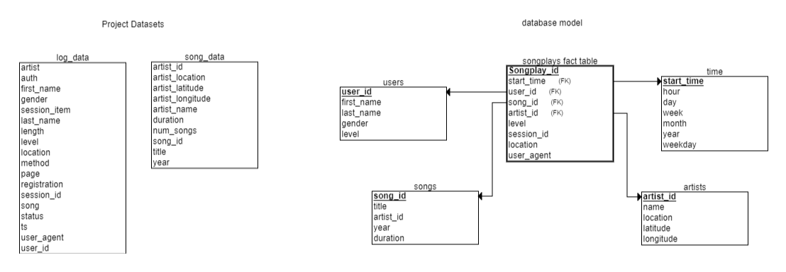

# Creating a Database with Apache Airflow
***
## Udacity Data Engineer Nano Degree Project 5
***
### Introduction
the project consists of creating the database, extracting the data from an s3 bucket and loading the data in the redshift.
### The goal
***
The goal is to extract data from a S3 bucket and load the data on redshift using Apache Airflow
### Database Schema
***


### Project Files
***
```create_tables.sql``` : Stores create table statements. <br>
```sparkify_erd_project``` : The database model. <br>
```udac_example_dag.py``` : Stores the DAG. <br>
```stage_redshift.py``` : Stores the statements for load data from s3 to redshift. <br>
```load_fact.py``` : Stores the statements to create the fact table. <br>
```load_dimension.py``` : Stores the statements to create the dimensions tables. <br>
```data_quality.py``` : Stores the statements to data quality check. <br>
```sql_queries.py``` : Stores the SQL queries for the ETL pipeline. <br>
```README.md``` : a project discussion.

### Execution
***
1. Create Amazon Redshift database.
2. Run `create_tables.sql` to create the tables.
3. Run `udac_example_dag.py` to process the entire datasets.
